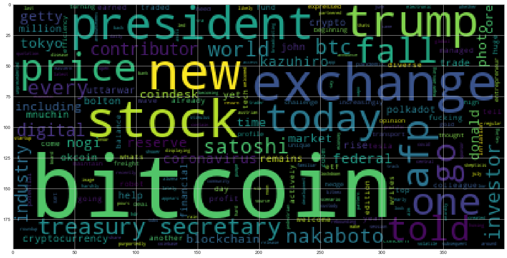
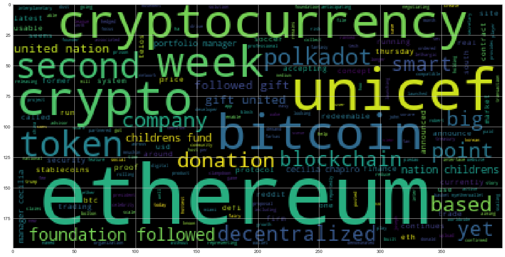

```python
import os
import pandas as pd
from datetime import date, datetime, timedelta
%matplotlib inline
```


```python
from nltk.sentiment.vader import SentimentIntensityAnalyzer
analyzer = SentimentIntensityAnalyzer()
```

# News Headlines Sentiment

Use the news api to pull the latest news articles for bitcoin and ethereum and create a DataFrame of sentiment scores for each coin. 

Use descriptive statistics to answer the following questions:
1. Which coin had the highest mean positive score?
2. Which coin had the highest negative score?
3. Which coin had the highest positive score?


```python
# Read your api key environment variable

from newsapi.newsapi_client import NewsApiClient
from dotenv import load_dotenv

load_dotenv("/Users/heenaroy/Desktop/.env")

```


    True


```python
# Create a newsapi client

newsapi = NewsApiClient(api_key=os.environ["NEWS_API_KEY"])
```


```python
# Set Date Parameters

current_date = date.today()
past_date = date.today() - timedelta(days=31)

# Create Function to get articles based on given date parameters

def get_articles(keyword):
    date = current_date
    print(f"Fetching news about '{keyword}'")
    print("*" * 30)
    while date > past_date:
        print(f"retrieving news from: {date}")
        article_dict = newsapi.get_everything(
            q=keyword,
            from_param=str(date),
            to=str(date),
            language="en",
            sort_by="relevancy",
            page=1,
        )        
        date = date - timedelta(days=1)
        articles = pd.DataFrame.from_dict(article_dict["articles"])
    return articles, article_dict
```


```python
# Fetch the Bitcoin news articles

bitcoin_articles, bitcoin_articles_dict = get_articles("bitcoin")
```

    Fetching news about 'bitcoin'
    ******************************
    retrieving news from: 2020-07-18
    retrieving news from: 2020-07-17
    retrieving news from: 2020-07-16
    retrieving news from: 2020-07-15
    retrieving news from: 2020-07-14
    retrieving news from: 2020-07-13
    retrieving news from: 2020-07-12
    retrieving news from: 2020-07-11
    retrieving news from: 2020-07-10
    retrieving news from: 2020-07-09
    retrieving news from: 2020-07-08
    retrieving news from: 2020-07-07
    retrieving news from: 2020-07-06
    retrieving news from: 2020-07-05
    retrieving news from: 2020-07-04
    retrieving news from: 2020-07-03
    retrieving news from: 2020-07-02
    retrieving news from: 2020-07-01
    retrieving news from: 2020-06-30
    retrieving news from: 2020-06-29
    retrieving news from: 2020-06-28
    retrieving news from: 2020-06-27
    retrieving news from: 2020-06-26
    retrieving news from: 2020-06-25
    retrieving news from: 2020-06-24
    retrieving news from: 2020-06-23
    retrieving news from: 2020-06-22
    retrieving news from: 2020-06-21
    retrieving news from: 2020-06-20
    retrieving news from: 2020-06-19
    retrieving news from: 2020-06-18


```python
# Fetch the Ethereum news articles

ethereum_articles, ethereum_articles_dict = get_articles("ethereum")
```

    Fetching news about 'ethereum'
    ******************************
    retrieving news from: 2020-07-18
    retrieving news from: 2020-07-17
    retrieving news from: 2020-07-16
    retrieving news from: 2020-07-15
    retrieving news from: 2020-07-14
    retrieving news from: 2020-07-13
    retrieving news from: 2020-07-12
    retrieving news from: 2020-07-11
    retrieving news from: 2020-07-10
    retrieving news from: 2020-07-09
    retrieving news from: 2020-07-08
    retrieving news from: 2020-07-07
    retrieving news from: 2020-07-06
    retrieving news from: 2020-07-05
    retrieving news from: 2020-07-04
    retrieving news from: 2020-07-03
    retrieving news from: 2020-07-02
    retrieving news from: 2020-07-01
    retrieving news from: 2020-06-30
    retrieving news from: 2020-06-29
    retrieving news from: 2020-06-28
    retrieving news from: 2020-06-27
    retrieving news from: 2020-06-26
    retrieving news from: 2020-06-25
    retrieving news from: 2020-06-24
    retrieving news from: 2020-06-23
    retrieving news from: 2020-06-22
    retrieving news from: 2020-06-21
    retrieving news from: 2020-06-20
    retrieving news from: 2020-06-19
    retrieving news from: 2020-06-18


```python
# Create function that computes average compound sentiment of headlines for each day

def article_sentiment_summarizer(articles_dict):
    article_sentiments = []
    for article in articles_dict["articles"]:
        try:
            text = article["content"]
            date = article["publishedAt"][:10]
            sentiment = analyzer.polarity_scores(text)
            compound = sentiment["compound"]
            pos = sentiment["pos"]
            neu = sentiment["neu"]
            neg = sentiment["neg"]
        
            article_sentiments.append({
                "Compound": compound,
                "Positive": pos,
                "Neutral": neu,
                "Negative": neg,
                "Text": text})
        
        except AttributeError:
            pass
        article_sentiments_df = pd.DataFrame.from_dict(article_sentiments)
    return article_sentiments_df

```


```python
# Create the Bitcoin sentiment scores DataFrame

bitcoin_sid = article_sentiment_summarizer(bitcoin_articles_dict)
bitcoin_sid.head()
```


<div>
<style scoped>
    .dataframe tbody tr th:only-of-type {
        vertical-align: middle;
    }

    .dataframe tbody tr th {
        vertical-align: top;
    }

    .dataframe thead th {
        text-align: right;
    }
</style>
<table border="1" class="dataframe">
  <thead>
    <tr style="text-align: right;">
      <th></th>
      <th>Compound</th>
      <th>Positive</th>
      <th>Neutral</th>
      <th>Negative</th>
      <th>Text</th>
    </tr>
  </thead>
  <tbody>
    <tr>
      <th>0</th>
      <td>0.5070</td>
      <td>0.090</td>
      <td>0.910</td>
      <td>0.0</td>
      <td>Our robot colleague Satoshi Nakaboto writes ab...</td>
    </tr>
    <tr>
      <th>1</th>
      <td>0.8176</td>
      <td>0.259</td>
      <td>0.741</td>
      <td>0.0</td>
      <td>New wave tech stocks like Zoom and Tesla have ...</td>
    </tr>
    <tr>
      <th>2</th>
      <td>0.0000</td>
      <td>0.000</td>
      <td>1.000</td>
      <td>0.0</td>
      <td>Bitcoin is increasingly being thought of as di...</td>
    </tr>
    <tr>
      <th>3</th>
      <td>0.0772</td>
      <td>0.043</td>
      <td>0.957</td>
      <td>0.0</td>
      <td>Opinions expressed by Entrepreneur contributor...</td>
    </tr>
    <tr>
      <th>4</th>
      <td>0.2500</td>
      <td>0.062</td>
      <td>0.938</td>
      <td>0.0</td>
      <td>The coronavirus pandemic and subsequent lockdo...</td>
    </tr>
  </tbody>
</table>
</div>


```python
# Create the Bitcoin sentiment scores DataFrame

ethereum_sid = article_sentiment_summarizer(ethereum_articles_dict)
ethereum_sid.head()
```


<div>
<style scoped>
    .dataframe tbody tr th:only-of-type {
        vertical-align: middle;
    }

    .dataframe tbody tr th {
        vertical-align: top;
    }

    .dataframe thead th {
        text-align: right;
    }
</style>
<table border="1" class="dataframe">
  <thead>
    <tr style="text-align: right;">
      <th></th>
      <th>Compound</th>
      <th>Positive</th>
      <th>Neutral</th>
      <th>Negative</th>
      <th>Text</th>
    </tr>
  </thead>
  <tbody>
    <tr>
      <th>0</th>
      <td>0.6908</td>
      <td>0.164</td>
      <td>0.836</td>
      <td>0.000</td>
      <td>The Ethereum Foundation followed up on its 201...</td>
    </tr>
    <tr>
      <th>1</th>
      <td>0.2023</td>
      <td>0.066</td>
      <td>0.891</td>
      <td>0.043</td>
      <td>Reddit is anticipating big demand for its Ethe...</td>
    </tr>
    <tr>
      <th>2</th>
      <td>-0.0772</td>
      <td>0.071</td>
      <td>0.849</td>
      <td>0.079</td>
      <td>Reddit is accepting proposals to scale Ethereu...</td>
    </tr>
    <tr>
      <th>3</th>
      <td>0.4939</td>
      <td>0.135</td>
      <td>0.865</td>
      <td>0.000</td>
      <td>President Donald Trump ordered Treasury Secret...</td>
    </tr>
    <tr>
      <th>4</th>
      <td>0.8481</td>
      <td>0.290</td>
      <td>0.710</td>
      <td>0.000</td>
      <td>Telos, currently ranked the second-most active...</td>
    </tr>
  </tbody>
</table>
</div>


```python
# Describe the Bitcoin Sentiment

bitcoin_sid.describe()
```


<div>
<style scoped>
    .dataframe tbody tr th:only-of-type {
        vertical-align: middle;
    }

    .dataframe tbody tr th {
        vertical-align: top;
    }

    .dataframe thead th {
        text-align: right;
    }
</style>
<table border="1" class="dataframe">
  <thead>
    <tr style="text-align: right;">
      <th></th>
      <th>Compound</th>
      <th>Positive</th>
      <th>Neutral</th>
      <th>Negative</th>
    </tr>
  </thead>
  <tbody>
    <tr>
      <th>count</th>
      <td>19.000000</td>
      <td>19.000000</td>
      <td>19.000000</td>
      <td>19.000000</td>
    </tr>
    <tr>
      <th>mean</th>
      <td>0.201289</td>
      <td>0.067737</td>
      <td>0.914684</td>
      <td>0.017579</td>
    </tr>
    <tr>
      <th>std</th>
      <td>0.350746</td>
      <td>0.072844</td>
      <td>0.072260</td>
      <td>0.037451</td>
    </tr>
    <tr>
      <th>min</th>
      <td>-0.526700</td>
      <td>0.000000</td>
      <td>0.741000</td>
      <td>0.000000</td>
    </tr>
    <tr>
      <th>25%</th>
      <td>0.000000</td>
      <td>0.000000</td>
      <td>0.866500</td>
      <td>0.000000</td>
    </tr>
    <tr>
      <th>50%</th>
      <td>0.202300</td>
      <td>0.057000</td>
      <td>0.935000</td>
      <td>0.000000</td>
    </tr>
    <tr>
      <th>75%</th>
      <td>0.485300</td>
      <td>0.112500</td>
      <td>0.951000</td>
      <td>0.000000</td>
    </tr>
    <tr>
      <th>max</th>
      <td>0.817600</td>
      <td>0.259000</td>
      <td>1.000000</td>
      <td>0.132000</td>
    </tr>
  </tbody>
</table>
</div>


```python
# Describe the Ethereum Sentiment

ethereum_sid.describe()
```


<div>
<style scoped>
    .dataframe tbody tr th:only-of-type {
        vertical-align: middle;
    }

    .dataframe tbody tr th {
        vertical-align: top;
    }

    .dataframe thead th {
        text-align: right;
    }
</style>
<table border="1" class="dataframe">
  <thead>
    <tr style="text-align: right;">
      <th></th>
      <th>Compound</th>
      <th>Positive</th>
      <th>Neutral</th>
      <th>Negative</th>
    </tr>
  </thead>
  <tbody>
    <tr>
      <th>count</th>
      <td>20.000000</td>
      <td>20.000000</td>
      <td>20.000000</td>
      <td>20.000000</td>
    </tr>
    <tr>
      <th>mean</th>
      <td>0.247385</td>
      <td>0.097900</td>
      <td>0.863400</td>
      <td>0.038650</td>
    </tr>
    <tr>
      <th>std</th>
      <td>0.446417</td>
      <td>0.073141</td>
      <td>0.075399</td>
      <td>0.061827</td>
    </tr>
    <tr>
      <th>min</th>
      <td>-0.865800</td>
      <td>0.000000</td>
      <td>0.710000</td>
      <td>0.000000</td>
    </tr>
    <tr>
      <th>25%</th>
      <td>0.000000</td>
      <td>0.060750</td>
      <td>0.825500</td>
      <td>0.000000</td>
    </tr>
    <tr>
      <th>50%</th>
      <td>0.381100</td>
      <td>0.084000</td>
      <td>0.868000</td>
      <td>0.000000</td>
    </tr>
    <tr>
      <th>75%</th>
      <td>0.520275</td>
      <td>0.140000</td>
      <td>0.914000</td>
      <td>0.069500</td>
    </tr>
    <tr>
      <th>max</th>
      <td>0.848100</td>
      <td>0.290000</td>
      <td>1.000000</td>
      <td>0.244000</td>
    </tr>
  </tbody>
</table>
</div>


```python
# Create automated answers for assignment questions:

print("QUESTIONS:")
print("")
print("")
print("Which coin had the highest mean positive score?")
if bitcoin_sid["Positive"].describe().loc["mean"] > ethereum_sid["Positive"].describe().loc["mean"]:
    print("")
    print(f"Bitcoin had the highest mean positive score at {round(bitcoin_sid['Positive'].describe().loc['mean'],4)} vs Ethereum at {round(ethereum_sid['Positive'].describe().loc['mean'],4)}")
    print("")
    print("")
elif bitcoin_sid["Positive"].describe().loc["mean"] < ethereum_sid["Positive"].describe().loc["mean"]:
    print("")
    print(f"Ethereum had the highest mean positive score at {round(ethereum_sid['Positive'].describe().loc['mean'],4)} vs Bitcoin at {round(bitcoin_sid['Positive'].describe().loc['mean'],4)}")
    print("")
    print("")
else:
    print("")
    print(f"Both Bitcoin and Ethereum had the same highest mean positive score with Bitcoin at {round(bitcoin_sid['Positive'].describe().loc['mean'],4)} and Ethereum at {round(ethereum_sid['Positive'].describe().loc['mean'],4)}")
    print("")
    print("")    
print("Which coin had the highest compoound score?")
if bitcoin_sid["Compound"].describe().loc["max"] > ethereum_sid["Compound"].describe().loc["max"]:
    print("")
    print(f"Bitcoin had the highest compound score at {round(bitcoin_sid['Compound'].describe().loc['max'],4)} vs Ethereum at {round(ethereum_sid['Compound'].describe().loc['max'],4)}")
    print("")
    print("")
elif bitcoin_sid["Compound"].describe().loc["max"] < ethereum_sid["Compound"].describe().loc["max"]:
    print("")
    print(f"Ethereum had the highest compound score at {round(ethereum_sid['Compound'].describe().loc['max'],4)} vs Bitcoin at {round(bitcoin_sid['Compound'].describe().loc['max'],4)}")
    print("")
    print("")
else:
    print("")
    print(f"Both Bitcoin and Ethereum had the same highest compound score with Bitcoin at {round(bitcoin_sid['Compound'].describe().loc['max'],4)} and Ethereum at {round(ethereum_sid['Compound'].describe().loc['max'],4)}")
    print("")
    print("")
print("Which coin had the highest positive score?")
if bitcoin_sid["Positive"].describe().loc["max"] > ethereum_sid["Positive"].describe().loc["max"]:
    print("")
    print(f"Bitcoin had the highest positive score at {round(bitcoin_sid['Positive'].describe().loc['max'],4)} vs Ethereum at {round(ethereum_sid['Positive'].describe().loc['max'],4)}")
    print("")
    print("")
elif bitcoin_sid["Positive"].describe().loc["max"] < ethereum_sid["Positive"].describe().loc["max"]:
    print("")
    print(f"Ethereum had the highest positive score at {round(ethereum_sid['Positive'].describe().loc['max'],4)} vs Bitcoin at {round(bitcoin_sid['Positive'].describe().loc['max'],4)}")
    print("")
    print("")
else:
    print("")
    print(f"Both Bitcoin and Ethereum had the same highest positive score with Bitcoin at {round(bitcoin_sid['Positive'].describe().loc['max'],4)} and Ethereum at {round(ethereum_sid['Positive'].describe().loc['max'],4)}")
    print("")
    print("")
```

    QUESTIONS:
    
    
    Which coin had the highest mean positive score?
    
    Ethereum had the highest mean positive score at 0.0979 vs Bitcoin at 0.0677
    
    
    Which coin had the highest compoound score?
    
    Ethereum had the highest compound score at 0.8481 vs Bitcoin at 0.8176
    
    
    Which coin had the highest positive score?
    
    Ethereum had the highest positive score at 0.29 vs Bitcoin at 0.259
    
    


---

# Tokenizer

In this section, you will use NLTK and Python to tokenize the text for each coin. Be sure to:
1. Lowercase each word
2. Remove Punctuation
3. Remove Stopwords


```python
from nltk.tokenize import word_tokenize, sent_tokenize, RegexpTokenizer
from nltk.corpus import stopwords
from nltk.stem import WordNetLemmatizer, PorterStemmer
from string import punctuation
import re
```


```python
# Create the tokenizer function

def tokenizer(text):     
    """Tokenizes text."""
    
    # Instantiate Tokenizer, Lemmatizer, and Stemmer
    
    tokenizer = RegexpTokenizer(r"\w+")
    lemmatizer = WordNetLemmatizer()
    stemmer = PorterStemmer()
    
    # Create a list of lowercase words with no punctuation
        
    text_tokens = text.apply(lambda x: tokenizer.tokenize(x.lower()))
    
    # Set the stop words
    
    sw = set(stopwords.words('english'))
    sw.update(("u", "it'", "'s", "n't", "…", "\`", "``", "char", "chars", "''","'", "r", " ", "..."))

    # Lemmatize & remove stop words
    
    tokens = text_tokens.apply(lambda w: [lemmatizer.lemmatize(w) for w in w if w not in sw])
    
    # Stem & remove stop words
    
    # tokens_stem = text_tokens.apply(lambda w: [stemmer.stem(w) for w in w if w not in sw])
    
    return tokens

```


```python
# Create a new tokens column for bitcoin

bitcoin_sid["Tokens"] = tokenizer(bitcoin_sid["Text"])

bitcoin_sid.head()
```


<div>
<style scoped>
    .dataframe tbody tr th:only-of-type {
        vertical-align: middle;
    }

    .dataframe tbody tr th {
        vertical-align: top;
    }

    .dataframe thead th {
        text-align: right;
    }
</style>
<table border="1" class="dataframe">
  <thead>
    <tr style="text-align: right;">
      <th></th>
      <th>Compound</th>
      <th>Positive</th>
      <th>Neutral</th>
      <th>Negative</th>
      <th>Text</th>
      <th>Tokens</th>
    </tr>
  </thead>
  <tbody>
    <tr>
      <th>0</th>
      <td>0.5070</td>
      <td>0.090</td>
      <td>0.910</td>
      <td>0.0</td>
      <td>Our robot colleague Satoshi Nakaboto writes ab...</td>
      <td>[robot, colleague, satoshi, nakaboto, writes, ...</td>
    </tr>
    <tr>
      <th>1</th>
      <td>0.8176</td>
      <td>0.259</td>
      <td>0.741</td>
      <td>0.0</td>
      <td>New wave tech stocks like Zoom and Tesla have ...</td>
      <td>[new, wave, tech, stock, like, zoom, tesla, ea...</td>
    </tr>
    <tr>
      <th>2</th>
      <td>0.0000</td>
      <td>0.000</td>
      <td>1.000</td>
      <td>0.0</td>
      <td>Bitcoin is increasingly being thought of as di...</td>
      <td>[bitcoin, increasingly, thought, digital, gold...</td>
    </tr>
    <tr>
      <th>3</th>
      <td>0.0772</td>
      <td>0.043</td>
      <td>0.957</td>
      <td>0.0</td>
      <td>Opinions expressed by Entrepreneur contributor...</td>
      <td>[opinion, expressed, entrepreneur, contributor...</td>
    </tr>
    <tr>
      <th>4</th>
      <td>0.2500</td>
      <td>0.062</td>
      <td>0.938</td>
      <td>0.0</td>
      <td>The coronavirus pandemic and subsequent lockdo...</td>
      <td>[coronavirus, pandemic, subsequent, lockdown, ...</td>
    </tr>
  </tbody>
</table>
</div>


```python
# Create a new tokens column for ethereum

ethereum_sid["Tokens"] = tokenizer(ethereum_sid["Text"])

ethereum_sid.head()
```


<div>
<style scoped>
    .dataframe tbody tr th:only-of-type {
        vertical-align: middle;
    }

    .dataframe tbody tr th {
        vertical-align: top;
    }

    .dataframe thead th {
        text-align: right;
    }
</style>
<table border="1" class="dataframe">
  <thead>
    <tr style="text-align: right;">
      <th></th>
      <th>Compound</th>
      <th>Positive</th>
      <th>Neutral</th>
      <th>Negative</th>
      <th>Text</th>
      <th>Tokens</th>
    </tr>
  </thead>
  <tbody>
    <tr>
      <th>0</th>
      <td>0.6908</td>
      <td>0.164</td>
      <td>0.836</td>
      <td>0.000</td>
      <td>The Ethereum Foundation followed up on its 201...</td>
      <td>[ethereum, foundation, followed, 2019, gift, u...</td>
    </tr>
    <tr>
      <th>1</th>
      <td>0.2023</td>
      <td>0.066</td>
      <td>0.891</td>
      <td>0.043</td>
      <td>Reddit is anticipating big demand for its Ethe...</td>
      <td>[reddit, anticipating, big, demand, ethereum, ...</td>
    </tr>
    <tr>
      <th>2</th>
      <td>-0.0772</td>
      <td>0.071</td>
      <td>0.849</td>
      <td>0.079</td>
      <td>Reddit is accepting proposals to scale Ethereu...</td>
      <td>[reddit, accepting, proposal, scale, ethereum,...</td>
    </tr>
    <tr>
      <th>3</th>
      <td>0.4939</td>
      <td>0.135</td>
      <td>0.865</td>
      <td>0.000</td>
      <td>President Donald Trump ordered Treasury Secret...</td>
      <td>[president, donald, trump, ordered, treasury, ...</td>
    </tr>
    <tr>
      <th>4</th>
      <td>0.8481</td>
      <td>0.290</td>
      <td>0.710</td>
      <td>0.000</td>
      <td>Telos, currently ranked the second-most active...</td>
      <td>[telos, currently, ranked, second, active, blo...</td>
    </tr>
  </tbody>
</table>
</div>


---

# NGrams and Frequency Analysis

In this section you will look at the ngrams and word frequency for each coin. 

1. Use NLTK to produce the n-grams for N = 2. 
2. List the top 10 words for each coin. 


```python
from collections import Counter
from nltk import ngrams, bigrams
import nltk
```


```python
# Create the processor function

def bigstring_processor(text):
    """Tokenizes text for ngram & frequency processing"""

    # Instantiate Lemmatizer
    wnl = WordNetLemmatizer()
    
    # Set stop words
    stop = stopwords.words('english')
    stop.append("u")
    stop.append("it'")
    stop.append("'s")
    stop.append("n't")
    stop.append("…")
    stop.append("\`")
    stop.append("``")
    stop.append("char")
    stop.append("''")
    stop.append("'")
    stop.append("/")
    stop.append("r")
    stop.append(" ")
    stop.append("chars")
    stop.append("...")
    stop = set(stop)

    # Create a list of the words
    words = word_tokenize(text.str.cat())
    
    # Convert the words to lowercase
    #words = list(filter(lambda w: w.lower(), words))
    words = [word.lower() for word in words]
    
    # Remove the punctuation
    words = list(filter(lambda t: t not in punctuation, words))
    
    # Remove the stopwords
    words = list(filter(lambda t: t.lower() not in stop, words))
    
    # Lemmatize Words into root words
    processed = [wnl.lemmatize(word) for word in words]

    return processed
```


```python
# Define function to give N-grams where N equals given number

def n_grams(text, n):
    grams = ngrams(bigstring_processor(text), n)
    num_words = str(n) + ("-Words") if n >> 1 else "Word"
    return pd.DataFrame(Counter(grams).most_common(20), columns=[num_words, "Count"])
```


```python
# Generate the Bitcoin N-grams where N=2

bitcoin_bigrams = n_grams(bitcoin_sid["Text"], 2)
bitcoin_bigrams
```


<div>
<style scoped>
    .dataframe tbody tr th:only-of-type {
        vertical-align: middle;
    }

    .dataframe tbody tr th {
        vertical-align: top;
    }

    .dataframe thead th {
        text-align: right;
    }
</style>
<table border="1" class="dataframe">
  <thead>
    <tr style="text-align: right;">
      <th></th>
      <th>2-Words</th>
      <th>Count</th>
    </tr>
  </thead>
  <tbody>
    <tr>
      <th>0</th>
      <td>(treasury, secretary)</td>
      <td>3</td>
    </tr>
    <tr>
      <th>1</th>
      <td>(satoshi, nakaboto)</td>
      <td>2</td>
    </tr>
    <tr>
      <th>2</th>
      <td>(bitcoin, btc)</td>
      <td>2</td>
    </tr>
    <tr>
      <th>3</th>
      <td>(federal, reserve)</td>
      <td>2</td>
    </tr>
    <tr>
      <th>4</th>
      <td>(photo, kazuhiro)</td>
      <td>2</td>
    </tr>
    <tr>
      <th>5</th>
      <td>(president, trump)</td>
      <td>2</td>
    </tr>
    <tr>
      <th>6</th>
      <td>(told, treasury)</td>
      <td>2</td>
    </tr>
    <tr>
      <th>7</th>
      <td>(go, bitcoin)</td>
      <td>2</td>
    </tr>
    <tr>
      <th>8</th>
      <td>(president, donald)</td>
      <td>2</td>
    </tr>
    <tr>
      <th>9</th>
      <td>(donald, trump)</td>
      <td>2</td>
    </tr>
    <tr>
      <th>10</th>
      <td>(bitcoin, core)</td>
      <td>2</td>
    </tr>
    <tr>
      <th>11</th>
      <td>(exchange, okcoin)</td>
      <td>2</td>
    </tr>
    <tr>
      <th>12</th>
      <td>(john, bolton)</td>
      <td>2</td>
    </tr>
    <tr>
      <th>13</th>
      <td>(robot, colleague)</td>
      <td>1</td>
    </tr>
    <tr>
      <th>14</th>
      <td>(colleague, satoshi)</td>
      <td>1</td>
    </tr>
    <tr>
      <th>15</th>
      <td>(nakaboto, writes)</td>
      <td>1</td>
    </tr>
    <tr>
      <th>16</th>
      <td>(writes, bitcoin)</td>
      <td>1</td>
    </tr>
    <tr>
      <th>17</th>
      <td>(btc, every)</td>
      <td>1</td>
    </tr>
  </tbody>
</table>
</div>


```python
# Generate the Ethereum N-grams where N=2

ethereum_bigrams = n_grams(ethereum_sid["Text"], 2)
ethereum_bigrams
```


<div>
<style scoped>
    .dataframe tbody tr th:only-of-type {
        vertical-align: middle;
    }

    .dataframe tbody tr th {
        vertical-align: top;
    }

    .dataframe thead th {
        text-align: right;
    }
</style>
<table border="1" class="dataframe">
  <thead>
    <tr style="text-align: right;">
      <th></th>
      <th>2-Words</th>
      <th>Count</th>
    </tr>
  </thead>
  <tbody>
    <tr>
      <th>0</th>
      <td>(ethereum, foundation)</td>
      <td>3</td>
    </tr>
    <tr>
      <th>1</th>
      <td>(foundation, followed)</td>
      <td>3</td>
    </tr>
    <tr>
      <th>2</th>
      <td>(followed, 2019)</td>
      <td>3</td>
    </tr>
    <tr>
      <th>3</th>
      <td>(2019, gift)</td>
      <td>3</td>
    </tr>
    <tr>
      <th>4</th>
      <td>(gift, united)</td>
      <td>3</td>
    </tr>
    <tr>
      <th>5</th>
      <td>(united, nation)</td>
      <td>3</td>
    </tr>
    <tr>
      <th>6</th>
      <td>(nation, childrens)</td>
      <td>3</td>
    </tr>
    <tr>
      <th>7</th>
      <td>(childrens, fund)</td>
      <td>3</td>
    </tr>
    <tr>
      <th>8</th>
      <td>(fund, unicef)</td>
      <td>3</td>
    </tr>
    <tr>
      <th>9</th>
      <td>(unicef, week)</td>
      <td>3</td>
    </tr>
    <tr>
      <th>10</th>
      <td>(week, second)</td>
      <td>3</td>
    </tr>
    <tr>
      <th>11</th>
      <td>(second, cryptocurrency)</td>
      <td>3</td>
    </tr>
    <tr>
      <th>12</th>
      <td>(cryptocurrency, donation)</td>
      <td>3</td>
    </tr>
    <tr>
      <th>13</th>
      <td>(donation, unicef)</td>
      <td>3</td>
    </tr>
    <tr>
      <th>14</th>
      <td>(unicef, crypto)</td>
      <td>3</td>
    </tr>
    <tr>
      <th>15</th>
      <td>(crypto, portfolio)</td>
      <td>3</td>
    </tr>
    <tr>
      <th>16</th>
      <td>(portfolio, manager)</td>
      <td>3</td>
    </tr>
    <tr>
      <th>17</th>
      <td>(manager, cecilia)</td>
      <td>3</td>
    </tr>
    <tr>
      <th>18</th>
      <td>(cecilia, chapiro)</td>
      <td>3</td>
    </tr>
    <tr>
      <th>19</th>
      <td>(chapiro, s…)</td>
      <td>3</td>
    </tr>
  </tbody>
</table>
</div>


```python
# # Use the token_count function to generate the top 10 words from each coin
# def token_count(tokens, N=10):
#     """Returns the top N tokens from the frequency count"""
#     return Counter(tokens).most_common(N)
```


```python
# Get the top 10 words for Bitcoin

bitcoin_count = n_grams(bitcoin_sid["Text"], 1)
bitcoin_count.head(10)
```


<div>
<style scoped>
    .dataframe tbody tr th:only-of-type {
        vertical-align: middle;
    }

    .dataframe tbody tr th {
        vertical-align: top;
    }

    .dataframe thead th {
        text-align: right;
    }
</style>
<table border="1" class="dataframe">
  <thead>
    <tr style="text-align: right;">
      <th></th>
      <th>Word</th>
      <th>Count</th>
    </tr>
  </thead>
  <tbody>
    <tr>
      <th>0</th>
      <td>(bitcoin,)</td>
      <td>20</td>
    </tr>
    <tr>
      <th>1</th>
      <td>(stock,)</td>
      <td>4</td>
    </tr>
    <tr>
      <th>2</th>
      <td>(exchange,)</td>
      <td>4</td>
    </tr>
    <tr>
      <th>3</th>
      <td>(president,)</td>
      <td>4</td>
    </tr>
    <tr>
      <th>4</th>
      <td>(trump,)</td>
      <td>4</td>
    </tr>
    <tr>
      <th>5</th>
      <td>(today,)</td>
      <td>3</td>
    </tr>
    <tr>
      <th>6</th>
      <td>(new,)</td>
      <td>3</td>
    </tr>
    <tr>
      <th>7</th>
      <td>(price,)</td>
      <td>3</td>
    </tr>
    <tr>
      <th>8</th>
      <td>(one,)</td>
      <td>3</td>
    </tr>
    <tr>
      <th>9</th>
      <td>(told,)</td>
      <td>3</td>
    </tr>
  </tbody>
</table>
</div>


```python
# Get the top 10 words for Ethereum

ethereum_count = n_grams(ethereum_sid["Text"], 1)
ethereum_count.head(10)
```


<div>
<style scoped>
    .dataframe tbody tr th:only-of-type {
        vertical-align: middle;
    }

    .dataframe tbody tr th {
        vertical-align: top;
    }

    .dataframe thead th {
        text-align: right;
    }
</style>
<table border="1" class="dataframe">
  <thead>
    <tr style="text-align: right;">
      <th></th>
      <th>Word</th>
      <th>Count</th>
    </tr>
  </thead>
  <tbody>
    <tr>
      <th>0</th>
      <td>(ethereum,)</td>
      <td>13</td>
    </tr>
    <tr>
      <th>1</th>
      <td>(unicef,)</td>
      <td>6</td>
    </tr>
    <tr>
      <th>2</th>
      <td>(cryptocurrency,)</td>
      <td>5</td>
    </tr>
    <tr>
      <th>3</th>
      <td>(crypto,)</td>
      <td>5</td>
    </tr>
    <tr>
      <th>4</th>
      <td>(bitcoin,)</td>
      <td>5</td>
    </tr>
    <tr>
      <th>5</th>
      <td>(week,)</td>
      <td>4</td>
    </tr>
    <tr>
      <th>6</th>
      <td>(token,)</td>
      <td>4</td>
    </tr>
    <tr>
      <th>7</th>
      <td>(polkadot,)</td>
      <td>4</td>
    </tr>
    <tr>
      <th>8</th>
      <td>(foundation,)</td>
      <td>3</td>
    </tr>
    <tr>
      <th>9</th>
      <td>(followed,)</td>
      <td>3</td>
    </tr>
  </tbody>
</table>
</div>


# Word Clouds

In this section, you will generate word clouds for each coin to summarize the news for each coin


```python
from wordcloud import WordCloud
import matplotlib.pyplot as plt
plt.style.use('seaborn-whitegrid')
import matplotlib as mpl
mpl.rcParams['figure.figsize'] = [20.0, 10.0]
```


```python
# Create function to create Word Clouds

def word_cloud(text):
    
    # Create a long string of all words in all articles

    big_string = " ".join(bigstring_processor(text))
    
    # Generate Word Cloud from Words in string of words
    
    wc = WordCloud().generate(big_string)
    
    # Setup up pyplot
    
    plt.style.use('seaborn-whitegrid')
    mpl.rcParams['figure.figsize'] = [20.0, 10.0]
    
    return plt.imshow(wc)
```


```python
# Generate the Bitcoin word cloud

wc_bitcoin = word_cloud(bitcoin_sid["Text"])
```





```python
# Generate the Ethereum word cloud

wc_ethereum = word_cloud(ethereum_sid["Text"])
```





# Named Entity Recognition

In this section, you will build a named entity recognition model for both coins and visualize the tags using SpaCy.


```python
import spacy
from spacy import displacy
```


```python
# Optional - download a language model for SpaCy
# !python -m spacy download en_core_web_sm
```


```python
# Load the spaCy model
nlp = spacy.load('en_core_web_sm')
```

## Bitcoin NER


```python
# Concatenate all of the bitcoin text together

bitcoin_bigstring = " ".join(bigstring_processor(bitcoin_sid["Text"]))
bitcoin_bigstring
```


    'robot colleague satoshi nakaboto writes bitcoin btc every fucking day welcome another edition bitcoin today satoshi nakaboto tell whats going bitcoin +2897 new wave tech stock like zoom tesla earned investor huge profit already year come world top actively managed exchange traded fund etf diverse balance… +4244 bitcoin increasingly thought digital gold high profile investor turning hedge potential inflation bitcoin price 30 since beginning the… +2761 opinion expressed entrepreneur contributor every industry deal unique set challenge concern one freight transport industry need maintain efficiency… +5585 coronavirus pandemic subsequent lockdown contain disease created unprecedented economic scenario central bank around world led u.s. federal reserve pumpe… +4087 pedestrian look electronic quotation board displaying share price tokyo stock exchange tokyo june 16 2020 photo kazuhiro nogi afp photo kazuhiro nogi/afp v… +8981 president trump purportedly told treasury secretary go bitcoin afp via getty image july 2019 u.s. president donald trump came harshly bitcoin broadcasting skepticis… +2482 economy rebounding low coronavirus likely return fall hard say whether last getty volatile session today d… +6225 austrian app aim track covid-19 including blockchain coindesk ’ market daily bitcoin news roundup back early access regular noon eastern time release subs… +1324 saying go rain pours lately bitcoin core development community appears experiencing welcomed shower today cryptocurrency exchange okcoin hdr global tra… +1854 crypto exchange okcoin bitmex recently partnered sponsor prolific open-source bitcoin core contributor amiti uttarwar uttarwar alumna coinbase bitcoin custody startup xapo +2984 crypto trader homing pattern thats becoming weirdly familiar stock fall bitcoin fall federal reserve make new stimulus announcement stock rise bitcoin rise one know… +6041 latest blockchain announce token redeemable bitcoin btc polkadot ’ proof-of-concept point polkadot running usable yet company called inter… +3490 bitcoin remains bargain despite carved solid gain second quarter according one price metric press time cryptocurrency trading near 9,450 nearly 47 far t… +2909 lethargic thursday across market including bitcoin yet longer-term view big growth story remains ethereum network defi movement continues help drive ether per… +3963 washington examiner published excerpt john bolton ’ new book detailing dramatic scene president trump told treasury secretary mnuchin go bitcoin tackling trade wi… +6846 chinese bitcoin miner manufacturer ebang estimate incurred net loss 2.5 million revenue 6.4 million q1 2020 financial disclosure posted wednesday update +4147 president donald trump ordered treasury secretary steve mnuchin focus clampdown bitcoin negotiating trade china former national security advisor john bolton reportedly claims.… +2371 galaxy digital working educational course financial adviser founder mike novogratz told coindesk hope help finally kick-start institutional use bitcoin tu… +6943'


```python
# Run the NER processor on all of the text

# bitcoin_ent_visual = ner_ent_processor(bitcoin_bigstring)

bitcoin_doc = nlp(bitcoin_bigstring)

# Add a title to the document

bitcoin_doc.user_data["title"] = "Bitcoin Named Entity Recognition"
```


```python
# Render the visualization
bitcoin_display = displacy.render(bitcoin_doc, style="ent")
```


<span class="tex2jax_ignore"><h2 style="margin: 0">Bitcoin Named Entity Recognition</h2>

<div class="entities" style="line-height: 2.5; direction: ltr">
<mark class="entity" style="background: #7aecec; padding: 0.45em 0.6em; margin: 0 0.25em; line-height: 1; border-radius: 0.35em;">
    robot colleague satoshi nakaboto
    <span style="font-size: 0.8em; font-weight: bold; line-height: 1; border-radius: 0.35em; text-transform: uppercase; vertical-align: middle; margin-left: 0.5rem">ORG</span>
</mark>
 writes 
<mark class="entity" style="background: #feca74; padding: 0.45em 0.6em; margin: 0 0.25em; line-height: 1; border-radius: 0.35em;">
    bitcoin
    <span style="font-size: 0.8em; font-weight: bold; line-height: 1; border-radius: 0.35em; text-transform: uppercase; vertical-align: middle; margin-left: 0.5rem">GPE</span>
</mark>
 btc every fucking day welcome another edition 
<mark class="entity" style="background: #feca74; padding: 0.45em 0.6em; margin: 0 0.25em; line-height: 1; border-radius: 0.35em;">
    bitcoin
    <span style="font-size: 0.8em; font-weight: bold; line-height: 1; border-radius: 0.35em; text-transform: uppercase; vertical-align: middle; margin-left: 0.5rem">GPE</span>
</mark>

<mark class="entity" style="background: #bfe1d9; padding: 0.45em 0.6em; margin: 0 0.25em; line-height: 1; border-radius: 0.35em;">
    today
    <span style="font-size: 0.8em; font-weight: bold; line-height: 1; border-radius: 0.35em; text-transform: uppercase; vertical-align: middle; margin-left: 0.5rem">DATE</span>
</mark>
 satoshi nakaboto tell whats going bitcoin +2897 new wave tech stock like zoom tesla earned investor huge profit already 
<mark class="entity" style="background: #bfe1d9; padding: 0.45em 0.6em; margin: 0 0.25em; line-height: 1; border-radius: 0.35em;">
    year
    <span style="font-size: 0.8em; font-weight: bold; line-height: 1; border-radius: 0.35em; text-transform: uppercase; vertical-align: middle; margin-left: 0.5rem">DATE</span>
</mark>
 come world top actively managed exchange traded fund etf diverse balance… +4244 
<mark class="entity" style="background: #feca74; padding: 0.45em 0.6em; margin: 0 0.25em; line-height: 1; border-radius: 0.35em;">
    bitcoin
    <span style="font-size: 0.8em; font-weight: bold; line-height: 1; border-radius: 0.35em; text-transform: uppercase; vertical-align: middle; margin-left: 0.5rem">GPE</span>
</mark>
 increasingly thought 
<mark class="entity" style="background: #7aecec; padding: 0.45em 0.6em; margin: 0 0.25em; line-height: 1; border-radius: 0.35em;">
    digital
    <span style="font-size: 0.8em; font-weight: bold; line-height: 1; border-radius: 0.35em; text-transform: uppercase; vertical-align: middle; margin-left: 0.5rem">ORG</span>
</mark>
 gold high profile investor turning 
<mark class="entity" style="background: #7aecec; padding: 0.45em 0.6em; margin: 0 0.25em; line-height: 1; border-radius: 0.35em;">
    hedge potential inflation bitcoin
    <span style="font-size: 0.8em; font-weight: bold; line-height: 1; border-radius: 0.35em; text-transform: uppercase; vertical-align: middle; margin-left: 0.5rem">ORG</span>
</mark>
 price 
<mark class="entity" style="background: #e4e7d2; padding: 0.45em 0.6em; margin: 0 0.25em; line-height: 1; border-radius: 0.35em;">
    30
    <span style="font-size: 0.8em; font-weight: bold; line-height: 1; border-radius: 0.35em; text-transform: uppercase; vertical-align: middle; margin-left: 0.5rem">CARDINAL</span>
</mark>
 since beginning the… +2761 opinion expressed entrepreneur contributor every industry deal unique set challenge concern 
<mark class="entity" style="background: #e4e7d2; padding: 0.45em 0.6em; margin: 0 0.25em; line-height: 1; border-radius: 0.35em;">
    one
    <span style="font-size: 0.8em; font-weight: bold; line-height: 1; border-radius: 0.35em; text-transform: uppercase; vertical-align: middle; margin-left: 0.5rem">CARDINAL</span>
</mark>
 freight transport industry need maintain efficiency… +5585 coronavirus pandemic subsequent lockdown contain disease created unprecedented economic scenario central bank around world led 
<mark class="entity" style="background: #feca74; padding: 0.45em 0.6em; margin: 0 0.25em; line-height: 1; border-radius: 0.35em;">
    u.s.
    <span style="font-size: 0.8em; font-weight: bold; line-height: 1; border-radius: 0.35em; text-transform: uppercase; vertical-align: middle; margin-left: 0.5rem">GPE</span>
</mark>
 federal reserve pumpe… +4087 pedestrian look electronic quotation board displaying share price 
<mark class="entity" style="background: #feca74; padding: 0.45em 0.6em; margin: 0 0.25em; line-height: 1; border-radius: 0.35em;">
    tokyo
    <span style="font-size: 0.8em; font-weight: bold; line-height: 1; border-radius: 0.35em; text-transform: uppercase; vertical-align: middle; margin-left: 0.5rem">GPE</span>
</mark>
 stock exchange tokyo 
<mark class="entity" style="background: #bfe1d9; padding: 0.45em 0.6em; margin: 0 0.25em; line-height: 1; border-radius: 0.35em;">
    june 16 2020
    <span style="font-size: 0.8em; font-weight: bold; line-height: 1; border-radius: 0.35em; text-transform: uppercase; vertical-align: middle; margin-left: 0.5rem">DATE</span>
</mark>
 photo kazuhiro nogi afp photo 
<mark class="entity" style="background: #aa9cfc; padding: 0.45em 0.6em; margin: 0 0.25em; line-height: 1; border-radius: 0.35em;">
    kazuhiro
    <span style="font-size: 0.8em; font-weight: bold; line-height: 1; border-radius: 0.35em; text-transform: uppercase; vertical-align: middle; margin-left: 0.5rem">PERSON</span>
</mark>
 nogi/afp v… +8981 president trump purportedly told 
<mark class="entity" style="background: #7aecec; padding: 0.45em 0.6em; margin: 0 0.25em; line-height: 1; border-radius: 0.35em;">
    treasury
    <span style="font-size: 0.8em; font-weight: bold; line-height: 1; border-radius: 0.35em; text-transform: uppercase; vertical-align: middle; margin-left: 0.5rem">ORG</span>
</mark>
 secretary go 
<mark class="entity" style="background: #7aecec; padding: 0.45em 0.6em; margin: 0 0.25em; line-height: 1; border-radius: 0.35em;">
    bitcoin afp
    <span style="font-size: 0.8em; font-weight: bold; line-height: 1; border-radius: 0.35em; text-transform: uppercase; vertical-align: middle; margin-left: 0.5rem">ORG</span>
</mark>
 via 
<mark class="entity" style="background: #7aecec; padding: 0.45em 0.6em; margin: 0 0.25em; line-height: 1; border-radius: 0.35em;">
    getty image
    <span style="font-size: 0.8em; font-weight: bold; line-height: 1; border-radius: 0.35em; text-transform: uppercase; vertical-align: middle; margin-left: 0.5rem">ORG</span>
</mark>

<mark class="entity" style="background: #bfe1d9; padding: 0.45em 0.6em; margin: 0 0.25em; line-height: 1; border-radius: 0.35em;">
    july 2019
    <span style="font-size: 0.8em; font-weight: bold; line-height: 1; border-radius: 0.35em; text-transform: uppercase; vertical-align: middle; margin-left: 0.5rem">DATE</span>
</mark>

<mark class="entity" style="background: #feca74; padding: 0.45em 0.6em; margin: 0 0.25em; line-height: 1; border-radius: 0.35em;">
    u.s.
    <span style="font-size: 0.8em; font-weight: bold; line-height: 1; border-radius: 0.35em; text-transform: uppercase; vertical-align: middle; margin-left: 0.5rem">GPE</span>
</mark>
 president 
<mark class="entity" style="background: #aa9cfc; padding: 0.45em 0.6em; margin: 0 0.25em; line-height: 1; border-radius: 0.35em;">
    donald trump
    <span style="font-size: 0.8em; font-weight: bold; line-height: 1; border-radius: 0.35em; text-transform: uppercase; vertical-align: middle; margin-left: 0.5rem">PERSON</span>
</mark>
 came harshly 
<mark class="entity" style="background: #feca74; padding: 0.45em 0.6em; margin: 0 0.25em; line-height: 1; border-radius: 0.35em;">
    bitcoin
    <span style="font-size: 0.8em; font-weight: bold; line-height: 1; border-radius: 0.35em; text-transform: uppercase; vertical-align: middle; margin-left: 0.5rem">GPE</span>
</mark>
 broadcasting skepticis… +2482 economy rebounding low coronavirus likely return fall hard say whether last getty volatile session 
<mark class="entity" style="background: #bfe1d9; padding: 0.45em 0.6em; margin: 0 0.25em; line-height: 1; border-radius: 0.35em;">
    today
    <span style="font-size: 0.8em; font-weight: bold; line-height: 1; border-radius: 0.35em; text-transform: uppercase; vertical-align: middle; margin-left: 0.5rem">DATE</span>
</mark>
 d… +6225 
<mark class="entity" style="background: #c887fb; padding: 0.45em 0.6em; margin: 0 0.25em; line-height: 1; border-radius: 0.35em;">
    austrian
    <span style="font-size: 0.8em; font-weight: bold; line-height: 1; border-radius: 0.35em; text-transform: uppercase; vertical-align: middle; margin-left: 0.5rem">NORP</span>
</mark>
 app aim track covid-19 including blockchain coindesk ’ market 
<mark class="entity" style="background: #bfe1d9; padding: 0.45em 0.6em; margin: 0 0.25em; line-height: 1; border-radius: 0.35em;">
    daily
    <span style="font-size: 0.8em; font-weight: bold; line-height: 1; border-radius: 0.35em; text-transform: uppercase; vertical-align: middle; margin-left: 0.5rem">DATE</span>
</mark>

<mark class="entity" style="background: #feca74; padding: 0.45em 0.6em; margin: 0 0.25em; line-height: 1; border-radius: 0.35em;">
    bitcoin
    <span style="font-size: 0.8em; font-weight: bold; line-height: 1; border-radius: 0.35em; text-transform: uppercase; vertical-align: middle; margin-left: 0.5rem">GPE</span>
</mark>
 news roundup back early access regular noon eastern time release subs… +1324 saying go rain pours lately bitcoin core development community appears experiencing welcomed shower today cryptocurrency exchange okcoin hdr global tra… +1854 crypto exchange okcoin 
<mark class="entity" style="background: #7aecec; padding: 0.45em 0.6em; margin: 0 0.25em; line-height: 1; border-radius: 0.35em;">
    bitmex
    <span style="font-size: 0.8em; font-weight: bold; line-height: 1; border-radius: 0.35em; text-transform: uppercase; vertical-align: middle; margin-left: 0.5rem">ORG</span>
</mark>
 recently partnered sponsor prolific open-source bitcoin core contributor amiti uttarwar uttarwar alumna coinbase bitcoin custody startup xapo +2984 crypto trader homing pattern thats becoming weirdly familiar stock fall 
<mark class="entity" style="background: #feca74; padding: 0.45em 0.6em; margin: 0 0.25em; line-height: 1; border-radius: 0.35em;">
    bitcoin
    <span style="font-size: 0.8em; font-weight: bold; line-height: 1; border-radius: 0.35em; text-transform: uppercase; vertical-align: middle; margin-left: 0.5rem">GPE</span>
</mark>
 fall federal reserve make new stimulus announcement stock rise 
<mark class="entity" style="background: #feca74; padding: 0.45em 0.6em; margin: 0 0.25em; line-height: 1; border-radius: 0.35em;">
    bitcoin
    <span style="font-size: 0.8em; font-weight: bold; line-height: 1; border-radius: 0.35em; text-transform: uppercase; vertical-align: middle; margin-left: 0.5rem">GPE</span>
</mark>
 rise one know… +6041 latest blockchain announce token redeemable 
<mark class="entity" style="background: #ddd; padding: 0.45em 0.6em; margin: 0 0.25em; line-height: 1; border-radius: 0.35em;">
    bitcoin btc polkadot
    <span style="font-size: 0.8em; font-weight: bold; line-height: 1; border-radius: 0.35em; text-transform: uppercase; vertical-align: middle; margin-left: 0.5rem">FAC</span>
</mark>
 ’ proof-of-concept point polkadot running usable yet company called inter… +3490 bitcoin remains bargain despite carved solid gain 
<mark class="entity" style="background: #bfe1d9; padding: 0.45em 0.6em; margin: 0 0.25em; line-height: 1; border-radius: 0.35em;">
    second quarter
    <span style="font-size: 0.8em; font-weight: bold; line-height: 1; border-radius: 0.35em; text-transform: uppercase; vertical-align: middle; margin-left: 0.5rem">DATE</span>
</mark>
 according 
<mark class="entity" style="background: #e4e7d2; padding: 0.45em 0.6em; margin: 0 0.25em; line-height: 1; border-radius: 0.35em;">
    one
    <span style="font-size: 0.8em; font-weight: bold; line-height: 1; border-radius: 0.35em; text-transform: uppercase; vertical-align: middle; margin-left: 0.5rem">CARDINAL</span>
</mark>
 price metric press time cryptocurrency trading near 
<mark class="entity" style="background: #e4e7d2; padding: 0.45em 0.6em; margin: 0 0.25em; line-height: 1; border-radius: 0.35em;">
    9,450
    <span style="font-size: 0.8em; font-weight: bold; line-height: 1; border-radius: 0.35em; text-transform: uppercase; vertical-align: middle; margin-left: 0.5rem">CARDINAL</span>
</mark>

<mark class="entity" style="background: #e4e7d2; padding: 0.45em 0.6em; margin: 0 0.25em; line-height: 1; border-radius: 0.35em;">
    nearly 47
    <span style="font-size: 0.8em; font-weight: bold; line-height: 1; border-radius: 0.35em; text-transform: uppercase; vertical-align: middle; margin-left: 0.5rem">CARDINAL</span>
</mark>
 far t… +2909 lethargic 
<mark class="entity" style="background: #bfe1d9; padding: 0.45em 0.6em; margin: 0 0.25em; line-height: 1; border-radius: 0.35em;">
    thursday
    <span style="font-size: 0.8em; font-weight: bold; line-height: 1; border-radius: 0.35em; text-transform: uppercase; vertical-align: middle; margin-left: 0.5rem">DATE</span>
</mark>
 across market including 
<mark class="entity" style="background: #feca74; padding: 0.45em 0.6em; margin: 0 0.25em; line-height: 1; border-radius: 0.35em;">
    bitcoin
    <span style="font-size: 0.8em; font-weight: bold; line-height: 1; border-radius: 0.35em; text-transform: uppercase; vertical-align: middle; margin-left: 0.5rem">GPE</span>
</mark>
 yet longer-term view big growth story remains ethereum network defi movement continues help drive ether per… +3963 
<mark class="entity" style="background: #7aecec; padding: 0.45em 0.6em; margin: 0 0.25em; line-height: 1; border-radius: 0.35em;">
    washington examiner
    <span style="font-size: 0.8em; font-weight: bold; line-height: 1; border-radius: 0.35em; text-transform: uppercase; vertical-align: middle; margin-left: 0.5rem">ORG</span>
</mark>
 published excerpt 
<mark class="entity" style="background: #aa9cfc; padding: 0.45em 0.6em; margin: 0 0.25em; line-height: 1; border-radius: 0.35em;">
    john bolton
    <span style="font-size: 0.8em; font-weight: bold; line-height: 1; border-radius: 0.35em; text-transform: uppercase; vertical-align: middle; margin-left: 0.5rem">PERSON</span>
</mark>
 ’ new book detailing dramatic scene president 
<mark class="entity" style="background: #aa9cfc; padding: 0.45em 0.6em; margin: 0 0.25em; line-height: 1; border-radius: 0.35em;">
    trump
    <span style="font-size: 0.8em; font-weight: bold; line-height: 1; border-radius: 0.35em; text-transform: uppercase; vertical-align: middle; margin-left: 0.5rem">PERSON</span>
</mark>
 told 
<mark class="entity" style="background: #7aecec; padding: 0.45em 0.6em; margin: 0 0.25em; line-height: 1; border-radius: 0.35em;">
    treasury
    <span style="font-size: 0.8em; font-weight: bold; line-height: 1; border-radius: 0.35em; text-transform: uppercase; vertical-align: middle; margin-left: 0.5rem">ORG</span>
</mark>
 secretary 
<mark class="entity" style="background: #7aecec; padding: 0.45em 0.6em; margin: 0 0.25em; line-height: 1; border-radius: 0.35em;">
    mnuchin go bitcoin tackling trade wi
    <span style="font-size: 0.8em; font-weight: bold; line-height: 1; border-radius: 0.35em; text-transform: uppercase; vertical-align: middle; margin-left: 0.5rem">ORG</span>
</mark>
… +6846 
<mark class="entity" style="background: #c887fb; padding: 0.45em 0.6em; margin: 0 0.25em; line-height: 1; border-radius: 0.35em;">
    chinese
    <span style="font-size: 0.8em; font-weight: bold; line-height: 1; border-radius: 0.35em; text-transform: uppercase; vertical-align: middle; margin-left: 0.5rem">NORP</span>
</mark>

<mark class="entity" style="background: #aa9cfc; padding: 0.45em 0.6em; margin: 0 0.25em; line-height: 1; border-radius: 0.35em;">
    bitcoin miner
    <span style="font-size: 0.8em; font-weight: bold; line-height: 1; border-radius: 0.35em; text-transform: uppercase; vertical-align: middle; margin-left: 0.5rem">PERSON</span>
</mark>
 manufacturer ebang estimate incurred net loss 
<mark class="entity" style="background: #e4e7d2; padding: 0.45em 0.6em; margin: 0 0.25em; line-height: 1; border-radius: 0.35em;">
    2.5 million
    <span style="font-size: 0.8em; font-weight: bold; line-height: 1; border-radius: 0.35em; text-transform: uppercase; vertical-align: middle; margin-left: 0.5rem">CARDINAL</span>
</mark>
 revenue 
<mark class="entity" style="background: #e4e7d2; padding: 0.45em 0.6em; margin: 0 0.25em; line-height: 1; border-radius: 0.35em;">
    6.4 million
    <span style="font-size: 0.8em; font-weight: bold; line-height: 1; border-radius: 0.35em; text-transform: uppercase; vertical-align: middle; margin-left: 0.5rem">CARDINAL</span>
</mark>
 q1 
<mark class="entity" style="background: #bfe1d9; padding: 0.45em 0.6em; margin: 0 0.25em; line-height: 1; border-radius: 0.35em;">
    2020
    <span style="font-size: 0.8em; font-weight: bold; line-height: 1; border-radius: 0.35em; text-transform: uppercase; vertical-align: middle; margin-left: 0.5rem">DATE</span>
</mark>
 financial disclosure posted 
<mark class="entity" style="background: #bfe1d9; padding: 0.45em 0.6em; margin: 0 0.25em; line-height: 1; border-radius: 0.35em;">
    wednesday
    <span style="font-size: 0.8em; font-weight: bold; line-height: 1; border-radius: 0.35em; text-transform: uppercase; vertical-align: middle; margin-left: 0.5rem">DATE</span>
</mark>
 update 
<mark class="entity" style="background: #c887fb; padding: 0.45em 0.6em; margin: 0 0.25em; line-height: 1; border-radius: 0.35em;">
    +4147
    <span style="font-size: 0.8em; font-weight: bold; line-height: 1; border-radius: 0.35em; text-transform: uppercase; vertical-align: middle; margin-left: 0.5rem">NORP</span>
</mark>
 president 
<mark class="entity" style="background: #aa9cfc; padding: 0.45em 0.6em; margin: 0 0.25em; line-height: 1; border-radius: 0.35em;">
    donald trump
    <span style="font-size: 0.8em; font-weight: bold; line-height: 1; border-radius: 0.35em; text-transform: uppercase; vertical-align: middle; margin-left: 0.5rem">PERSON</span>
</mark>
 ordered 
<mark class="entity" style="background: #7aecec; padding: 0.45em 0.6em; margin: 0 0.25em; line-height: 1; border-radius: 0.35em;">
    treasury
    <span style="font-size: 0.8em; font-weight: bold; line-height: 1; border-radius: 0.35em; text-transform: uppercase; vertical-align: middle; margin-left: 0.5rem">ORG</span>
</mark>
 secretary 
<mark class="entity" style="background: #aa9cfc; padding: 0.45em 0.6em; margin: 0 0.25em; line-height: 1; border-radius: 0.35em;">
    steve mnuchin
    <span style="font-size: 0.8em; font-weight: bold; line-height: 1; border-radius: 0.35em; text-transform: uppercase; vertical-align: middle; margin-left: 0.5rem">PERSON</span>
</mark>
 focus clampdown 
<mark class="entity" style="background: #feca74; padding: 0.45em 0.6em; margin: 0 0.25em; line-height: 1; border-radius: 0.35em;">
    bitcoin
    <span style="font-size: 0.8em; font-weight: bold; line-height: 1; border-radius: 0.35em; text-transform: uppercase; vertical-align: middle; margin-left: 0.5rem">GPE</span>
</mark>
 negotiating trade 
<mark class="entity" style="background: #feca74; padding: 0.45em 0.6em; margin: 0 0.25em; line-height: 1; border-radius: 0.35em;">
    china
    <span style="font-size: 0.8em; font-weight: bold; line-height: 1; border-radius: 0.35em; text-transform: uppercase; vertical-align: middle; margin-left: 0.5rem">GPE</span>
</mark>
 former 
<mark class="entity" style="background: #7aecec; padding: 0.45em 0.6em; margin: 0 0.25em; line-height: 1; border-radius: 0.35em;">
    national security
    <span style="font-size: 0.8em; font-weight: bold; line-height: 1; border-radius: 0.35em; text-transform: uppercase; vertical-align: middle; margin-left: 0.5rem">ORG</span>
</mark>
 advisor 
<mark class="entity" style="background: #aa9cfc; padding: 0.45em 0.6em; margin: 0 0.25em; line-height: 1; border-radius: 0.35em;">
    john bolton
    <span style="font-size: 0.8em; font-weight: bold; line-height: 1; border-radius: 0.35em; text-transform: uppercase; vertical-align: middle; margin-left: 0.5rem">PERSON</span>
</mark>
 reportedly claims.… +2371 galaxy digital working educational course financial adviser founder 
<mark class="entity" style="background: #aa9cfc; padding: 0.45em 0.6em; margin: 0 0.25em; line-height: 1; border-radius: 0.35em;">
    mike novogratz
    <span style="font-size: 0.8em; font-weight: bold; line-height: 1; border-radius: 0.35em; text-transform: uppercase; vertical-align: middle; margin-left: 0.5rem">PERSON</span>
</mark>
 told 
<mark class="entity" style="background: #aa9cfc; padding: 0.45em 0.6em; margin: 0 0.25em; line-height: 1; border-radius: 0.35em;">
    coindesk hope
    <span style="font-size: 0.8em; font-weight: bold; line-height: 1; border-radius: 0.35em; text-transform: uppercase; vertical-align: middle; margin-left: 0.5rem">PERSON</span>
</mark>
 help finally kick-start institutional use bitcoin tu… +6943</div></span>


```python
# List all Entities
for ent in bitcoin_doc.ents:
    print(ent.text, ent.label_)
```

    robot colleague satoshi nakaboto ORG
    bitcoin GPE
    bitcoin GPE
    today DATE
    year DATE
    bitcoin GPE
    digital ORG
    hedge potential inflation bitcoin ORG
    30 CARDINAL
    one CARDINAL
    u.s. GPE
    tokyo GPE
    june 16 2020 DATE
    kazuhiro PERSON
    treasury ORG
    bitcoin afp ORG
    getty image ORG
    july 2019 DATE
    u.s. GPE
    donald trump PERSON
    bitcoin GPE
    today DATE
    austrian NORP
    daily DATE
    bitcoin GPE
    bitmex ORG
    bitcoin GPE
    bitcoin GPE
    bitcoin btc polkadot FAC
    second quarter DATE
    one CARDINAL
    9,450 CARDINAL
    nearly 47 CARDINAL
    thursday DATE
    bitcoin GPE
    washington examiner ORG
    john bolton PERSON
    trump PERSON
    treasury ORG
    mnuchin go bitcoin tackling trade wi ORG
    chinese NORP
    bitcoin miner PERSON
    2.5 million CARDINAL
    6.4 million CARDINAL
    2020 DATE
    wednesday DATE
    +4147 NORP
    donald trump PERSON
    treasury ORG
    steve mnuchin PERSON
    bitcoin GPE
    china GPE
    national security ORG
    john bolton PERSON
    mike novogratz PERSON
    coindesk hope PERSON


---

## Ethereum NER


```python
# Concatenate all of the bitcoin text together

ethereum_bigstring = " ".join(bigstring_processor(ethereum_sid["Text"]))

ethereum_bigstring
```


    'ethereum foundation followed 2019 gift united nation childrens fund unicef week second cryptocurrency donation unicef crypto portfolio manager cecilia chapiro s… +5371 reddit anticipating big demand ethereum-based community point system one month rolling product social medium site looking scaling solution posted in… +2596 reddit accepting proposal scale ethereum wake launching new crypto project block confirmed company announced today partnered ethereum foundation… +1945 president donald trump ordered treasury secretary steve mnuchin focus clampdown bitcoin negotiating trade china former national security advisor john bolton reportedly claims.… +2129 telos currently ranked second-most active blockchain worldwide set enable developer create run ethereum-compatible smart contract without transaction fee telos smart cont… +2033 ethereum foundation followed 2019 gift united nation childrens fund unicef week second cryptocurrency donation unicef crypto portfolio manager cecilia chapiro s… +5169 ethereum foundation followed 2019 gift united nation childrens fund unicef week second cryptocurrency donation unicef crypto portfolio manager cecilia chapiro s… +5169 fan south korean professional soccer able collect trade digital token representing league player use play fantasy soccer game run firm sorare south… +2404 piedao launched usd++ hedged basket usd-denominated ethereum eth -based stablecoins decentralized organization aiming reduce risk associated holding stablecoins t… +2616 miami-based cryptocurrency firm centrum tech built fairy dust paid celebrity hoo-ha co-founder robert joseph farkas going real time real prison 25 mill… +4476 latest blockchain announce token redeemable bitcoin btc polkadot ’ proof-of-concept point polkadot running usable yet company called inter… +3490 myetherwallet well-known ethereum wallet app releasing feature named “ host site ” provides easy interface user upload website interplanetary file system +2994 lethargic thursday across market including bitcoin yet longer-term view big growth story remains ethereum network defi movement continues help drive ether per… +3963 one ethereum crypto ’ “ hottest use case ” decentralized finance got big scare june 17th market participant thought key application attacked bad actor th… +3203 xrp like alternative currency security argues former chair u.s. commodity future trading commission cftc op-ed international financial law review c… +5364 ethereum stable 230 225 support level u dollar eth price seems eyeing major bullish break 238 240 ul li ethereum currently attempting u… +2315 comp governance token decentralized finance defi lending protocol compound soon listed trading coinbase exchange announced thursday would begin accepting inbou… +1022 latest blockchain announce token redeemable bitcoin btc polkadot proof-of-concept point polkadot running usable yet company called interl… +3280 speculation mounting around upcoming protocol upgrade ethereum go however price smart contract giant seems leveled continues consolidati… +2694 like bitcoin top cryptocurrencies past week stagnant ethereum cryptocurrency consolidated around 230 failing breakout either direction stepp… +2942'


```python
# Run the NER processor on all of the text

ethereum_doc = nlp(ethereum_bigstring)

# Add a title to the document

ethereum_doc.user_data["title"] = "Ethereum Named Entity Recognition"
```


```python
# Render the visualization

ethereum_display = displacy.render(ethereum_doc, style="ent")
```


<span class="tex2jax_ignore"><h2 style="margin: 0">Ethereum Named Entity Recognition</h2>

<div class="entities" style="line-height: 2.5; direction: ltr">
<mark class="entity" style="background: #7aecec; padding: 0.45em 0.6em; margin: 0 0.25em; line-height: 1; border-radius: 0.35em;">
    ethereum foundation
    <span style="font-size: 0.8em; font-weight: bold; line-height: 1; border-radius: 0.35em; text-transform: uppercase; vertical-align: middle; margin-left: 0.5rem">ORG</span>
</mark>
 followed 
<mark class="entity" style="background: #bfe1d9; padding: 0.45em 0.6em; margin: 0 0.25em; line-height: 1; border-radius: 0.35em;">
    2019
    <span style="font-size: 0.8em; font-weight: bold; line-height: 1; border-radius: 0.35em; text-transform: uppercase; vertical-align: middle; margin-left: 0.5rem">DATE</span>
</mark>
 gift united nation childrens fund unicef week 
<mark class="entity" style="background: #e4e7d2; padding: 0.45em 0.6em; margin: 0 0.25em; line-height: 1; border-radius: 0.35em;">
    second
    <span style="font-size: 0.8em; font-weight: bold; line-height: 1; border-radius: 0.35em; text-transform: uppercase; vertical-align: middle; margin-left: 0.5rem">ORDINAL</span>
</mark>
 cryptocurrency donation unicef crypto portfolio manager cecilia 
<mark class="entity" style="background: #aa9cfc; padding: 0.45em 0.6em; margin: 0 0.25em; line-height: 1; border-radius: 0.35em;">
    chapiro s
    <span style="font-size: 0.8em; font-weight: bold; line-height: 1; border-radius: 0.35em; text-transform: uppercase; vertical-align: middle; margin-left: 0.5rem">PERSON</span>
</mark>
… +5371 reddit anticipating big demand ethereum-based community point system 
<mark class="entity" style="background: #bfe1d9; padding: 0.45em 0.6em; margin: 0 0.25em; line-height: 1; border-radius: 0.35em;">
    one month
    <span style="font-size: 0.8em; font-weight: bold; line-height: 1; border-radius: 0.35em; text-transform: uppercase; vertical-align: middle; margin-left: 0.5rem">DATE</span>
</mark>
 rolling product social medium site looking scaling solution posted in… +2596 reddit accepting proposal scale ethereum wake launching new crypto project block confirmed company announced 
<mark class="entity" style="background: #bfe1d9; padding: 0.45em 0.6em; margin: 0 0.25em; line-height: 1; border-radius: 0.35em;">
    today
    <span style="font-size: 0.8em; font-weight: bold; line-height: 1; border-radius: 0.35em; text-transform: uppercase; vertical-align: middle; margin-left: 0.5rem">DATE</span>
</mark>
 partnered ethereum foundation… +1945 president 
<mark class="entity" style="background: #aa9cfc; padding: 0.45em 0.6em; margin: 0 0.25em; line-height: 1; border-radius: 0.35em;">
    donald trump
    <span style="font-size: 0.8em; font-weight: bold; line-height: 1; border-radius: 0.35em; text-transform: uppercase; vertical-align: middle; margin-left: 0.5rem">PERSON</span>
</mark>
 ordered 
<mark class="entity" style="background: #7aecec; padding: 0.45em 0.6em; margin: 0 0.25em; line-height: 1; border-radius: 0.35em;">
    treasury
    <span style="font-size: 0.8em; font-weight: bold; line-height: 1; border-radius: 0.35em; text-transform: uppercase; vertical-align: middle; margin-left: 0.5rem">ORG</span>
</mark>
 secretary 
<mark class="entity" style="background: #aa9cfc; padding: 0.45em 0.6em; margin: 0 0.25em; line-height: 1; border-radius: 0.35em;">
    steve mnuchin
    <span style="font-size: 0.8em; font-weight: bold; line-height: 1; border-radius: 0.35em; text-transform: uppercase; vertical-align: middle; margin-left: 0.5rem">PERSON</span>
</mark>
 focus clampdown 
<mark class="entity" style="background: #feca74; padding: 0.45em 0.6em; margin: 0 0.25em; line-height: 1; border-radius: 0.35em;">
    bitcoin
    <span style="font-size: 0.8em; font-weight: bold; line-height: 1; border-radius: 0.35em; text-transform: uppercase; vertical-align: middle; margin-left: 0.5rem">GPE</span>
</mark>
 negotiating trade 
<mark class="entity" style="background: #feca74; padding: 0.45em 0.6em; margin: 0 0.25em; line-height: 1; border-radius: 0.35em;">
    china
    <span style="font-size: 0.8em; font-weight: bold; line-height: 1; border-radius: 0.35em; text-transform: uppercase; vertical-align: middle; margin-left: 0.5rem">GPE</span>
</mark>
 former 
<mark class="entity" style="background: #7aecec; padding: 0.45em 0.6em; margin: 0 0.25em; line-height: 1; border-radius: 0.35em;">
    national security
    <span style="font-size: 0.8em; font-weight: bold; line-height: 1; border-radius: 0.35em; text-transform: uppercase; vertical-align: middle; margin-left: 0.5rem">ORG</span>
</mark>
 advisor 
<mark class="entity" style="background: #aa9cfc; padding: 0.45em 0.6em; margin: 0 0.25em; line-height: 1; border-radius: 0.35em;">
    john bolton
    <span style="font-size: 0.8em; font-weight: bold; line-height: 1; border-radius: 0.35em; text-transform: uppercase; vertical-align: middle; margin-left: 0.5rem">PERSON</span>
</mark>
 reportedly claims.… +2129 telos currently ranked 
<mark class="entity" style="background: #e4e7d2; padding: 0.45em 0.6em; margin: 0 0.25em; line-height: 1; border-radius: 0.35em;">
    second
    <span style="font-size: 0.8em; font-weight: bold; line-height: 1; border-radius: 0.35em; text-transform: uppercase; vertical-align: middle; margin-left: 0.5rem">ORDINAL</span>
</mark>
-most active blockchain worldwide set enable developer create run ethereum-compatible smart contract without transaction fee telos smart cont… +2033 ethereum foundation followed 
<mark class="entity" style="background: #e4e7d2; padding: 0.45em 0.6em; margin: 0 0.25em; line-height: 1; border-radius: 0.35em;">
    2019
    <span style="font-size: 0.8em; font-weight: bold; line-height: 1; border-radius: 0.35em; text-transform: uppercase; vertical-align: middle; margin-left: 0.5rem">CARDINAL</span>
</mark>
 gift united nation childrens fund unicef week 
<mark class="entity" style="background: #e4e7d2; padding: 0.45em 0.6em; margin: 0 0.25em; line-height: 1; border-radius: 0.35em;">
    second
    <span style="font-size: 0.8em; font-weight: bold; line-height: 1; border-radius: 0.35em; text-transform: uppercase; vertical-align: middle; margin-left: 0.5rem">ORDINAL</span>
</mark>
 cryptocurrency donation unicef crypto portfolio manager cecilia chapiro s… +5169 ethereum foundation followed 
<mark class="entity" style="background: #e4e7d2; padding: 0.45em 0.6em; margin: 0 0.25em; line-height: 1; border-radius: 0.35em;">
    2019
    <span style="font-size: 0.8em; font-weight: bold; line-height: 1; border-radius: 0.35em; text-transform: uppercase; vertical-align: middle; margin-left: 0.5rem">CARDINAL</span>
</mark>
 gift united nation childrens fund unicef week 
<mark class="entity" style="background: #e4e7d2; padding: 0.45em 0.6em; margin: 0 0.25em; line-height: 1; border-radius: 0.35em;">
    second
    <span style="font-size: 0.8em; font-weight: bold; line-height: 1; border-radius: 0.35em; text-transform: uppercase; vertical-align: middle; margin-left: 0.5rem">ORDINAL</span>
</mark>
 cryptocurrency donation unicef crypto portfolio manager cecilia chapiro s… +5169 fan 
<mark class="entity" style="background: #c887fb; padding: 0.45em 0.6em; margin: 0 0.25em; line-height: 1; border-radius: 0.35em;">
    south korean
    <span style="font-size: 0.8em; font-weight: bold; line-height: 1; border-radius: 0.35em; text-transform: uppercase; vertical-align: middle; margin-left: 0.5rem">NORP</span>
</mark>
 professional soccer able collect trade digital token representing league player use play fantasy soccer game run firm sorare south… +2404 piedao launched usd++ hedged basket usd-denominated ethereum eth -based stablecoins decentralized organization aiming reduce risk associated holding stablecoins t… +2616 
<mark class="entity" style="background: #feca74; padding: 0.45em 0.6em; margin: 0 0.25em; line-height: 1; border-radius: 0.35em;">
    miami
    <span style="font-size: 0.8em; font-weight: bold; line-height: 1; border-radius: 0.35em; text-transform: uppercase; vertical-align: middle; margin-left: 0.5rem">GPE</span>
</mark>
-based cryptocurrency firm centrum tech built fairy dust paid celebrity hoo-ha co-founder 
<mark class="entity" style="background: #aa9cfc; padding: 0.45em 0.6em; margin: 0 0.25em; line-height: 1; border-radius: 0.35em;">
    robert joseph farkas
    <span style="font-size: 0.8em; font-weight: bold; line-height: 1; border-radius: 0.35em; text-transform: uppercase; vertical-align: middle; margin-left: 0.5rem">PERSON</span>
</mark>
 going real time real prison 
<mark class="entity" style="background: #e4e7d2; padding: 0.45em 0.6em; margin: 0 0.25em; line-height: 1; border-radius: 0.35em;">
    25
    <span style="font-size: 0.8em; font-weight: bold; line-height: 1; border-radius: 0.35em; text-transform: uppercase; vertical-align: middle; margin-left: 0.5rem">CARDINAL</span>
</mark>
 mill… +4476 latest blockchain announce token redeemable 
<mark class="entity" style="background: #ddd; padding: 0.45em 0.6em; margin: 0 0.25em; line-height: 1; border-radius: 0.35em;">
    bitcoin btc polkadot
    <span style="font-size: 0.8em; font-weight: bold; line-height: 1; border-radius: 0.35em; text-transform: uppercase; vertical-align: middle; margin-left: 0.5rem">FAC</span>
</mark>
 ’ proof-of-concept point polkadot running usable yet company called inter… +3490 myetherwallet well-known ethereum wallet 
<mark class="entity" style="background: #7aecec; padding: 0.45em 0.6em; margin: 0 0.25em; line-height: 1; border-radius: 0.35em;">
    app
    <span style="font-size: 0.8em; font-weight: bold; line-height: 1; border-radius: 0.35em; text-transform: uppercase; vertical-align: middle; margin-left: 0.5rem">ORG</span>
</mark>
 releasing feature named “ host site ” provides easy interface user upload website interplanetary file system +2994 lethargic 
<mark class="entity" style="background: #bfe1d9; padding: 0.45em 0.6em; margin: 0 0.25em; line-height: 1; border-radius: 0.35em;">
    thursday
    <span style="font-size: 0.8em; font-weight: bold; line-height: 1; border-radius: 0.35em; text-transform: uppercase; vertical-align: middle; margin-left: 0.5rem">DATE</span>
</mark>
 across market including 
<mark class="entity" style="background: #feca74; padding: 0.45em 0.6em; margin: 0 0.25em; line-height: 1; border-radius: 0.35em;">
    bitcoin
    <span style="font-size: 0.8em; font-weight: bold; line-height: 1; border-radius: 0.35em; text-transform: uppercase; vertical-align: middle; margin-left: 0.5rem">GPE</span>
</mark>
 yet longer-term view big growth story remains ethereum network defi movement continues help drive ether per… +3963 one ethereum crypto ’ “ hottest use case ” decentralized finance got big scare 
<mark class="entity" style="background: #bfe1d9; padding: 0.45em 0.6em; margin: 0 0.25em; line-height: 1; border-radius: 0.35em;">
    june 17th
    <span style="font-size: 0.8em; font-weight: bold; line-height: 1; border-radius: 0.35em; text-transform: uppercase; vertical-align: middle; margin-left: 0.5rem">DATE</span>
</mark>
 market participant thought key application attacked bad actor th… +3203 xrp like alternative currency security argues former 
<mark class="entity" style="background: #7aecec; padding: 0.45em 0.6em; margin: 0 0.25em; line-height: 1; border-radius: 0.35em;">
    chair u.s. commodity future trading commission
    <span style="font-size: 0.8em; font-weight: bold; line-height: 1; border-radius: 0.35em; text-transform: uppercase; vertical-align: middle; margin-left: 0.5rem">ORG</span>
</mark>

<mark class="entity" style="background: #7aecec; padding: 0.45em 0.6em; margin: 0 0.25em; line-height: 1; border-radius: 0.35em;">
    cftc
    <span style="font-size: 0.8em; font-weight: bold; line-height: 1; border-radius: 0.35em; text-transform: uppercase; vertical-align: middle; margin-left: 0.5rem">ORG</span>
</mark>
 op-ed international financial law review c… +5364 ethereum stable 
<mark class="entity" style="background: #e4e7d2; padding: 0.45em 0.6em; margin: 0 0.25em; line-height: 1; border-radius: 0.35em;">
    230 225
    <span style="font-size: 0.8em; font-weight: bold; line-height: 1; border-radius: 0.35em; text-transform: uppercase; vertical-align: middle; margin-left: 0.5rem">CARDINAL</span>
</mark>
 support level u dollar eth price seems eyeing major bullish break 
<mark class="entity" style="background: #e4e7d2; padding: 0.45em 0.6em; margin: 0 0.25em; line-height: 1; border-radius: 0.35em;">
    238
    <span style="font-size: 0.8em; font-weight: bold; line-height: 1; border-radius: 0.35em; text-transform: uppercase; vertical-align: middle; margin-left: 0.5rem">CARDINAL</span>
</mark>

<mark class="entity" style="background: #e4e7d2; padding: 0.45em 0.6em; margin: 0 0.25em; line-height: 1; border-radius: 0.35em;">
    240
    <span style="font-size: 0.8em; font-weight: bold; line-height: 1; border-radius: 0.35em; text-transform: uppercase; vertical-align: middle; margin-left: 0.5rem">CARDINAL</span>
</mark>
 ul li ethereum currently attempting u… +2315 comp governance token decentralized finance defi lending protocol compound soon listed trading coinbase exchange announced 
<mark class="entity" style="background: #bfe1d9; padding: 0.45em 0.6em; margin: 0 0.25em; line-height: 1; border-radius: 0.35em;">
    thursday
    <span style="font-size: 0.8em; font-weight: bold; line-height: 1; border-radius: 0.35em; text-transform: uppercase; vertical-align: middle; margin-left: 0.5rem">DATE</span>
</mark>
 would begin accepting inbou… +1022 latest blockchain announce token redeemable 
<mark class="entity" style="background: #ddd; padding: 0.45em 0.6em; margin: 0 0.25em; line-height: 1; border-radius: 0.35em;">
    bitcoin btc
    <span style="font-size: 0.8em; font-weight: bold; line-height: 1; border-radius: 0.35em; text-transform: uppercase; vertical-align: middle; margin-left: 0.5rem">FAC</span>
</mark>
 polkadot proof-of-concept point polkadot running usable yet company called interl… +3280 speculation mounting around upcoming protocol upgrade ethereum go however price smart contract giant seems leveled continues consolidati… +2694 like 
<mark class="entity" style="background: #feca74; padding: 0.45em 0.6em; margin: 0 0.25em; line-height: 1; border-radius: 0.35em;">
    bitcoin
    <span style="font-size: 0.8em; font-weight: bold; line-height: 1; border-radius: 0.35em; text-transform: uppercase; vertical-align: middle; margin-left: 0.5rem">GPE</span>
</mark>
 top cryptocurrencies 
<mark class="entity" style="background: #bfe1d9; padding: 0.45em 0.6em; margin: 0 0.25em; line-height: 1; border-radius: 0.35em;">
    past week
    <span style="font-size: 0.8em; font-weight: bold; line-height: 1; border-radius: 0.35em; text-transform: uppercase; vertical-align: middle; margin-left: 0.5rem">DATE</span>
</mark>
 stagnant ethereum cryptocurrency consolidated around 
<mark class="entity" style="background: #e4e7d2; padding: 0.45em 0.6em; margin: 0 0.25em; line-height: 1; border-radius: 0.35em;">
    230
    <span style="font-size: 0.8em; font-weight: bold; line-height: 1; border-radius: 0.35em; text-transform: uppercase; vertical-align: middle; margin-left: 0.5rem">CARDINAL</span>
</mark>
 failing breakout either direction stepp… +2942</div></span>


```python
# List all Entities

for ent in ethereum_doc.ents:
    print(ent.text, ent.label_)
```

    ethereum foundation ORG
    2019 DATE
    second ORDINAL
    chapiro s PERSON
    one month DATE
    today DATE
    donald trump PERSON
    treasury ORG
    steve mnuchin PERSON
    bitcoin GPE
    china GPE
    national security ORG
    john bolton PERSON
    second ORDINAL
    2019 CARDINAL
    second ORDINAL
    2019 CARDINAL
    second ORDINAL
    south korean NORP
    miami GPE
    robert joseph farkas PERSON
    25 CARDINAL
    bitcoin btc polkadot FAC
    app ORG
    thursday DATE
    bitcoin GPE
    june 17th DATE
    chair u.s. commodity future trading commission ORG
    cftc ORG
    230 225 CARDINAL
    238 CARDINAL
    240 CARDINAL
    thursday DATE
    bitcoin btc FAC
    bitcoin GPE
    past week DATE
    230 CARDINAL


```python

```


```python

```
